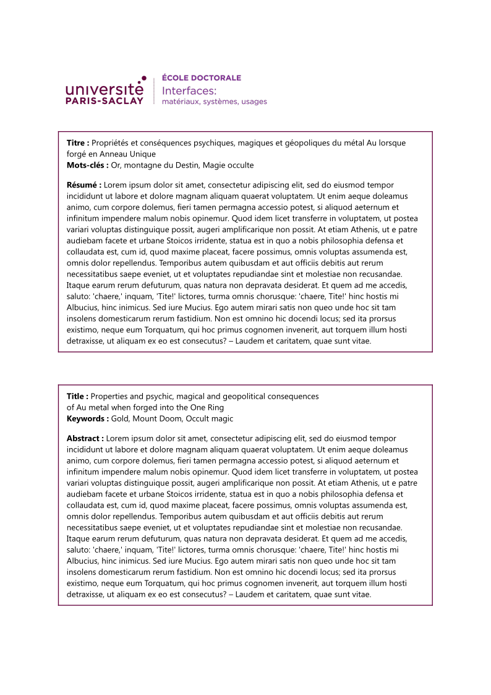

# The `paris-saclay-thesis-flat` Typst package

An unofficial, flat-design Typst template for Paris-Saclay University theses

About the name

- `typst-paris-saclay-thesis-flat` is the name of the GitHub repo, `paris-saclay-thesis-flat` is the name of the Typst template
- The Typst template name does not contain `typst`, because it is redundant[^typst_template_naming]
- The Typst template name is not just `paris-saclay-thesis`, because it is not an official template[^typst_template_naming]. I got rid of the white gradients in the vertical banner, so here is a flat-design version (was accepted by the university library for my thesis).

[^typst_template_naming]: https://github.com/typst/packages?tab=readme-ov-file#submission-guidelines

## Template adaptation checklist

- [ ] Fill out `README.md`
  - Change the `my-package` package name, including code snippets
  - Check section contents and/or delete sections that don't apply
- [x] Check and/or replace `LICENSE` by something that suits your needs
- [x] Fill out `typst.toml`
  - See also the [typst/packages README](https://github.com/typst/packages/?tab=readme-ov-file#package-format)
- [ ] Adapt Repository URLs in `CHANGELOG.md`
  - Consider only committing that file with your first release, or removing the "Initial Release" part in the beginning
- [ ] Adapt or deactivate the release workflow in `.github/workflows/release.yml`
  - to deactivate it, delete that file or remove/comment out lines 2-4 (`on:` and following)
  - to use the workflow
    - [ ] check the values under `env:`, particularly `REGISTRY_REPO`
    - [ ] if you don't have one, [create a fine-grained personal access token](https://github.com/settings/tokens?type=beta) with [only Contents permission](https://stackoverflow.com/a/75116350/371191) for the `REGISTRY_REPO`
    - [ ] on this repo, create a secret `REGISTRY_TOKEN` (at `https://github.com/[user]/[repo]/settings/secrets/actions`) that contains the so created token

    if configured correctly, whenever you create a tag `v...`, your package will be pushed onto a branch on the `REGISTRY_REPO`, from which you can then create a pull request against [typst/packages](https://github.com/typst/packages/)
- [ ] remove/replace the example test case
- [ ] (add your actual code, docs and tests)
- [ ] remove this section from the README

## Getting Started

TODO

## Ressources

- [Official MS Word & LaTeX templates](https://www.universite-paris-saclay.fr/recherche/doctorat-et-hdr/le-guide-de-la-soutenance-de-doctorat#Ressources) from the Paris-Saclay University

# License

[MIT-0](./LICENSE)